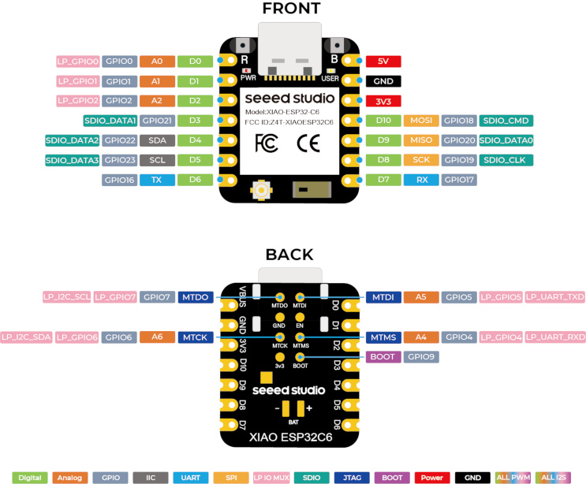

Es geht um eine Uhr, bei der währen der Schlafenszeit, das Display ausgeschlaten wird.

Teile: 

Um 4:30 Uhr wird die Zeit über einen NTP-Server synchronisiert. in der restlichen Zeit ist Wlan abgeschaltet und der ESP32 geht in den modem_sleep.

