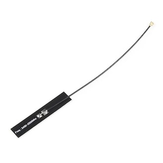
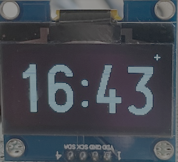
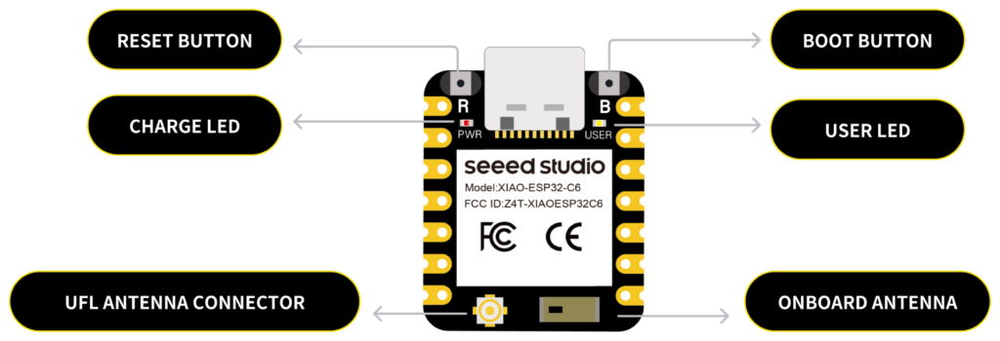

Es geht um eine Uhr, bei der währen der Schlafenszeit, das Display ausgeschaltet wird.

Teile: 

 

 

Um 4:30 Uhr wird die Zeit über einen NTP-Server synchronisiert. In der restlichen Zeit ist Wlan abgeschaltet und der ESP32 geht in den modem_sleep.

Dies ist die zweite Version. 

Leider musste ich feststellen, dass mein Wlan-Signal an dem Ort wo ich die Uhr aufgestellt habe zu schwach ist.
Deshalb nutze ich jetzt einen XIOA-ESP32C6 von SEED mit einer externen Antenne.

28.2.2026

Inzwischen habe ich mir überlegt, dass es gut wäre schon um 5:30 Uhr, vorab einen Hinweis zu bekommen. 

Und ich habe einfach Claude gebeten den Code zu ändern.