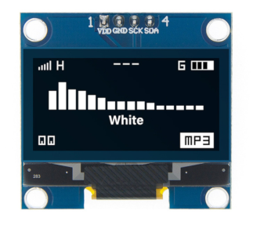

Es geht um eine Uhr, bei der währen der Schlafenszeit, das Display ausgeschlaten wird.

Teile: 

  
 > 

Um 4:30 Uhr wird die Zeit über einen NTP-Server synchronisiert. in der restlichen Zeit ist Wlan abgeschaltet und der ESP32 geht in den modem_sleep.

Dies ist die zweite Version. 

Leider musste ich feststellen, dass mein Wlan-Signal an dem Ort wo ich die Uhr aufgestellt habe zu schwach ist.
Deshalb nutze ich jetzt einen XIOA-ESP32C6 von SEED mit einer externen Antenne.